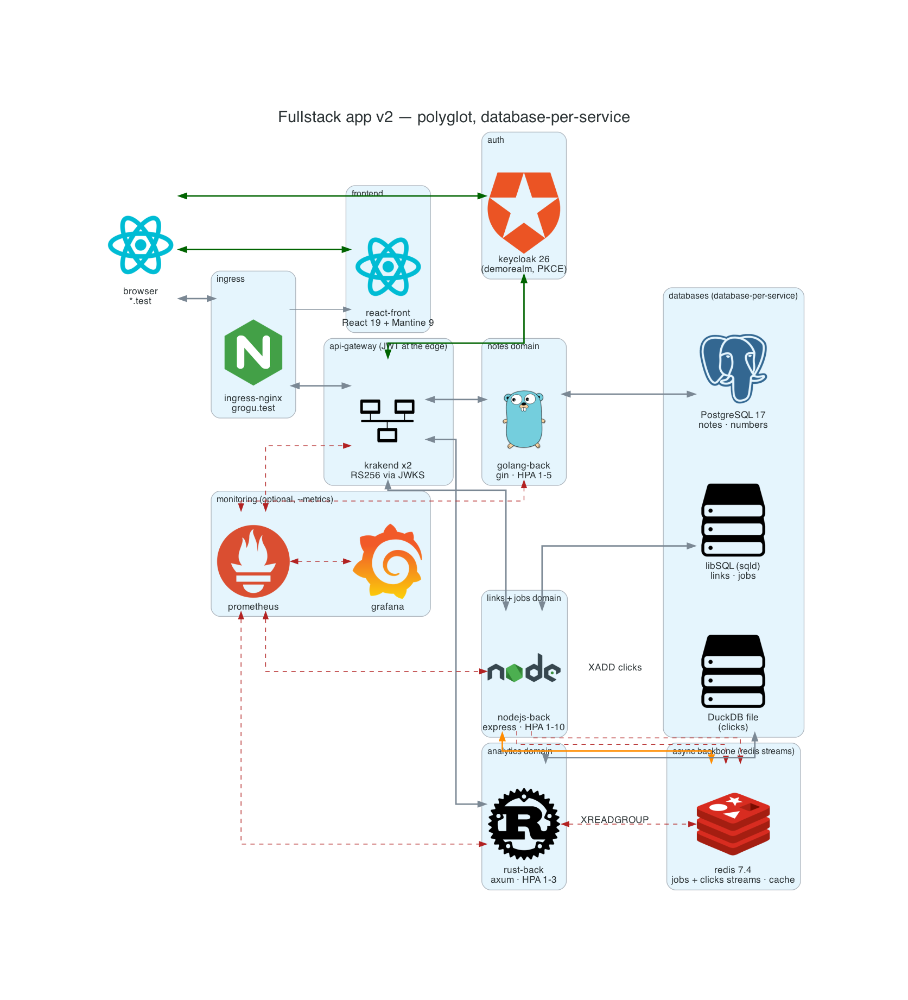
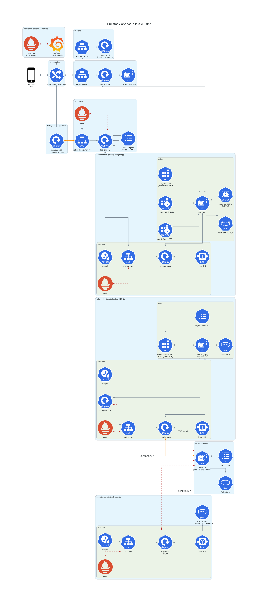
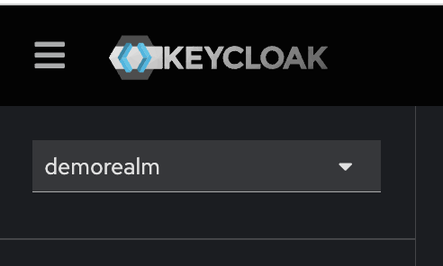

# k8s-helm-sandbox

A full-stack application (React SPA → KrakenD API gateway → Node.js + Go backends → PostgreSQL/Redis, with Keycloak auth and optional Prometheus/Grafana monitoring) deployed as a single [Helm](https://helm.sh) chart on a local [Minikube](https://minikube.sigs.k8s.io) cluster.

**TL;DR — one command brings up the whole working app:**

```bash
./start
```

then open [http://grogu.test/](http://grogu.test/) and log in with the pre-seeded user **demo / demo**.

### Architecture




Detailed, always-current description: [docs/ARCHITECTURE.md](./docs/ARCHITECTURE.md).
Guide for LLM/coding agents working with this repo: [AGENTS.md](./AGENTS.md).
One command per environment — `./start` (Minikube on this Mac), `./start orbstack` (Ubuntu machine in OrbStack on this Mac — full rehearsal of the remote pipeline), `./start lan` (VirtualBox VM on the Wi-Fi), `./start vps` (VPS + TLS), the remote three deployed via Ansible + ArgoCD: [docs/RUN.md](./docs/RUN.md) is the launch guide for all of them, with the deep dives in [docs/DEPLOY-VPS-ARGOCD.md](./docs/DEPLOY-VPS-ARGOCD.md), [docs/DEPLOY-LAN-VIRTUALBOX.md](./docs/DEPLOY-LAN-VIRTUALBOX.md), [gitops/README.md](./gitops/README.md).

---

## Prerequisites (macOS)

| Tool | Install |
|---|---|
| Docker Desktop | `brew install --cask docker` (then start it once and give it ≥ 6 GB) |
| minikube | `brew install minikube` |
| kubectl | `brew install kubectl` (optional — minikube has a built-in one) |
| helm | `brew install helm` |
| helm-secrets plugin | `helm plugin install https://github.com/jkroepke/helm-secrets --version v4.6.2` |
| sops | `brew install sops` |
| gpg | `brew install gnupg` |

Verify everything at once:

```bash
make check
```

## Launch

```bash
./start
```

The script is **idempotent** — run it again at any time and it repairs/resumes instead of failing. It performs the entire former manual sequence:

1. starts Docker Desktop if it is not running;
2. creates/starts the minikube cluster (`docker` driver, Calico CNI) and enables the addons (metrics-server, ingress, ingress-dns, storage, dashboard);
3. appends `auth.test`, `grogu.test`, `grafana.test`, `prom.test → 127.0.0.1` to `/etc/hosts` (asks for the sudo password on the first run only);
4. imports the demo GPG key and presets its passphrase in gpg-agent, so SOPS decryption never prompts;
5. installs/upgrades the Helm release `ap` from `./helm-chart` with the SOPS-encrypted `secrets.yaml`;
6. waits until every pod is Ready;
7. starts `sudo minikube tunnel` in the background (asks for the sudo password);
8. runs end-to-end smoke tests through the ingress: front page, gateway health, public APIs of both backends, and the **private** APIs using a real JWT obtained for the seeded user.

### What is pre-seeded (no manual setup needed)

- **Keycloak user** `demo / demo` — imported with the `demorealm` realm (configurable in `helm-chart/values.yaml` → `auth.seedUser`).
- **Keycloak admin** is `admin / admin` (from `secrets.yaml`).
- **Database rows** — the migration Job seeds `nodejs_numbers = 3087` and `golang_numbers = 1703` (`helm-chart/migrations/migration-1.sql`).

### URLs after `./start`

| URL | What |
|---|---|
| [http://grogu.test/](http://grogu.test/) | React app (login `demo / demo`) |
| [http://grogu.test/api/v1/nodejs/public](http://grogu.test/api/v1/nodejs/public) | Node API through KrakenD |
| [http://grogu.test/api/v1/golang/public/fibonacci/10](http://grogu.test/api/v1/golang/public/fibonacci/10) | Go API through KrakenD |
| [http://auth.test/](http://auth.test/) | Keycloak admin console (`admin / admin`) |
| [http://prom.test/](http://prom.test/), [http://grafana.test/](http://grafana.test/) | Prometheus / Grafana (only with `--metrics`) |

### Flags

```bash
./start --metrics          # + Prometheus & Grafana (kube-prometheus-stack subchart)
./start --load-generator   # + busybox load generator to watch the HPA scale
./start --skip-smoke       # skip the automated end-to-end checks
./start --check-only       # preflight checks only, changes nothing
./start --reset            # delete the minikube profile first (clean slate)
make status                # what is running right now
```

## Troubleshooting

- **URLs stopped resolving** (after sleep/reboot): the tunnel died — just run `./start` again; it detects and restarts it.
- **A pod is stuck**: `make status`, then `kubectl describe pod <name>`.
- **First run is slow**: the minikube VM plus several GB of images are downloaded (10–20 min). Later runs take minutes.
- **sudo prompts**: `/etc/hosts` (first run) and `minikube tunnel` (every start — it must run as root). Both are asked once per run.
- **`./start` fails at `minikube start` after an interrupted run (Ctrl-C)**: the profile is likely corrupted. The script detects it, shows the real error (`.local/minikube-start.log`), deletes the broken profile and recreates the cluster automatically; demo data is re-seeded. To force it: `./start --reset`. See [docs/RUN.md](./docs/RUN.md) for details.
- **Keycloak behaves like it forgot changes made in the admin UI**: in `start-dev` mode with a fresh database the realm is re-imported from `helm-chart/config/realm-export.json` on a wiped cluster; UI-made changes live in Postgres and survive pod restarts, but not `./stop --purge` (that wipes the whole VM).

<details>
<summary><b>Manual mode (legacy) — what <code>./start</code> automates</b></summary>

```bash
minikube start --driver=docker --cni=calico

minikube addons enable metrics-server
minikube addons enable ingress-dns
minikube addons enable ingress
minikube addons enable storage-provisioner
minikube addons enable default-storageclass
minikube addons enable dashboard

# charts/ already vendors the kube-prometheus-stack dependency, so this is only
# needed after changing Chart.yaml dependencies:
helm repo add prometheus-community https://prometheus-community.github.io/helm-charts
helm repo update && helm dependency update

GPG_TTY=$(tty); export GPG_TTY

# /etc/hosts:
#   127.0.0.1 auth.test
#   127.0.0.1 grogu.test
#   127.0.0.1 grafana.test
#   127.0.0.1 prom.test

# import the demo key (passphrase: example1)
gpg --import demo-secret-key.asc

# optional toggles live in ./helm-chart/values.yaml:
#   metrics.enabled: true          (Prometheus + Grafana)
#   loadGenerator.enable: true     (HPA stress test)

# app launch
helm secrets install ap ./helm-chart -f secrets.yaml

# separate terminal:
sudo minikube tunnel
```

Note: the ServiceMonitor CRD does not need to be applied manually — the vendored kube-prometheus-stack chart ships its own CRDs.

</details>

## Useful commands

```bash
# edit secrets
make secrets-edit                      # = GPG_TTY=$(tty) helm secrets edit secrets.yaml

# re-deploy after chart changes
make upgrade                           # = helm secrets upgrade --install ap ./helm-chart -f secrets.yaml

# port-forward databases for local development
kubectl port-forward postgres-statefulset-0 5432
kubectl port-forward <redis-pod-name> 6379

# build & push a service image (images are pulled from Docker Hub by the chart)
cd nodejs-back && docker build -t mmko67/grogu-api:0.1.7 . && docker image push mmko67/grogu-api:0.1.7
# then bump the version in helm-chart/values.yaml and run make upgrade

# edit the KrakenD config visually
https://designer.krakend.io/
```

## Roadmap

- **Phase 2 — chart hardening**: Redis Deployment → StatefulSet, metrics/HPA for the Go service, metrics for Postgres/Redis, image version bumps (redis 4.0.11 / postgres 14.0 / keycloak 25.0.6 are old), resource requests for all pods.
- **Phase 3 — VPS home lab**: move from Minikube to a real cluster on a VPS (k3s single node), ingress-nginx + cert-manager/Let's Encrypt with a real DNS name, SOPS+age for secrets, and ArgoCD syncing the cluster from this git repo so the whole setup can be restored on a fresh VPS with one bootstrap command. Not started yet.

---

### Keycloak first-run (optional — the demo user is already seeded)

1. go to [http://auth.test/](http://auth.test/), log in as `admin / admin`
2. select `demorealm`
3. the user `demo` (password `demo`) is already there — you can add more users if you like

