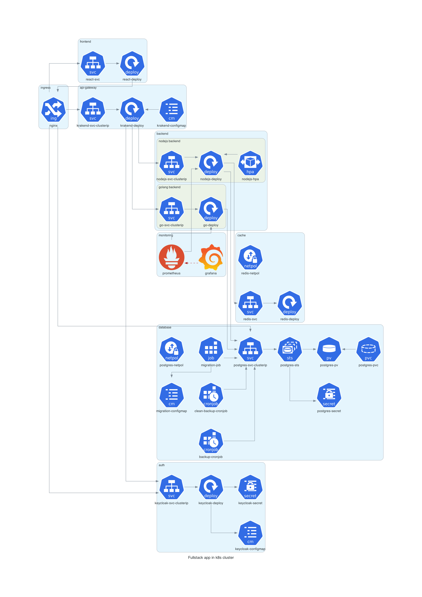

### Architecture



### TODO
- [x] helm
- [x] react front
- [x] postgres
- [x] redis cache
- [ ] migrate redis from deployment to statefulset
- [x] node.js api
- [x] golang api
- [x] krakend api gateway
- [x] postgres using k8s pvc
- [x] redis using k8s pvc
- [x] keycloak for auth
- [x] api start working only after postgres and redis using initContainers
- [x] ingress
- [x] health checks
- [x] container limits
- [x] db migration using k8s job
- [x] db daily backups using cronjobs
- [x] db weekly backups cleaners using cronjobs
- [x] secrets with PGP and SOPS for sensitive info
- [x] restart policies
- [x] network policies
- [x] horizontal pod autoscaling
- [x] prometheus
- [x] grafana
- [x] connect redis to node.js
- [ ] connect redis to golang
- [x] metrics for node.js api
- [ ] metrics for golang api
- [x] hpa for node.js api
- [ ] hpa for golang api
- [ ] metrics for postgres
- [ ] metrics for redis
- [x] encrypt postgres secrets with PGP and SOPS
- [ ] encrypt keycloak secrets with PGP and SOPS
- [ ] encrypt redis secrets with PGP and SOPS

#### Prerequisites
- docker / docker desktop [setup](https://docs.docker.com/desktop/setup/install/mac-install/)
- minikube [setup](https://minikube.sigs.k8s.io/docs/start/?arch=%2Fmacos%2Farm64%2Fstable%2Fhomebrew)
- helm [setup](https://helm.sh/docs/intro/install/)
- helm-secrets plugin [setup](https://github.com/jkroepke/helm-secrets/wiki/Installation)
- gpg [setup](https://dev.to/zemse/setup-gpg-on-macos-2iib)
- sops [setup](https://formulae.brew.sh/formula/sops)


#### Local launch for mac with docker desktop and minikube:

```bash
minikube start --driver=docker --cni=calico

# enable addons
minikube addons enable metrics-server
minikube addons enable ingress-dns
minikube addons enable ingress
minikube addons enable storage-provisioner
minikube addons enable default-storageclass
minikube addons enable dashboard

# add helm repos
helm repo add prometheus-community https://prometheus-community.github.io/helm-charts
helm repo update
helm dependency update

# gpg envs
GPG_TTY=$(tty)
export GPG_TTY

# insert hosts 
# for app, iam, grafana, prometheus
sudo nano /etc/hosts
127.0.0.1 auth.test
127.0.0.1 grogu.test
127.0.0.1 grafana.test   
127.0.0.1 prom.test
 
# additional CustomResourceDefinition for service monitor
kubectl apply -f https://raw.githubusercontent.com/coreos/prometheus-operator/master/example/prometheus-operator-crd/monitoring.coreos.com_servicemonitors.yaml

# import secret key
# ! attention: this file should not be store in git or any other public space
# it is here only for demo purpose
gpg --import demo-secret-key.asc

# app launch
helm secrets install ap ./helm-chart -f secrets.yaml  

# passphrase for the secret above
passphrase: example1   

# separate terminal
sudo minikube tunnel
```
