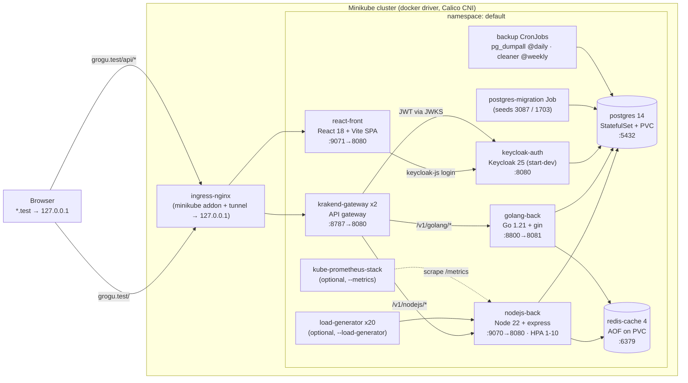
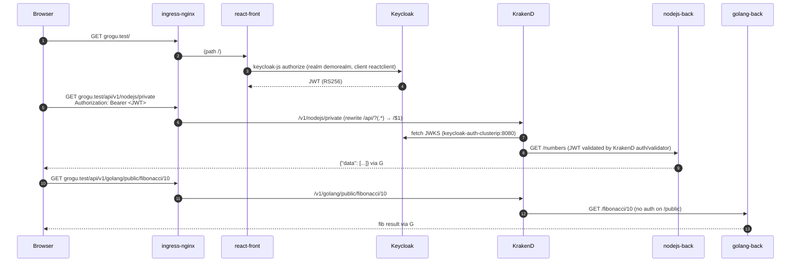
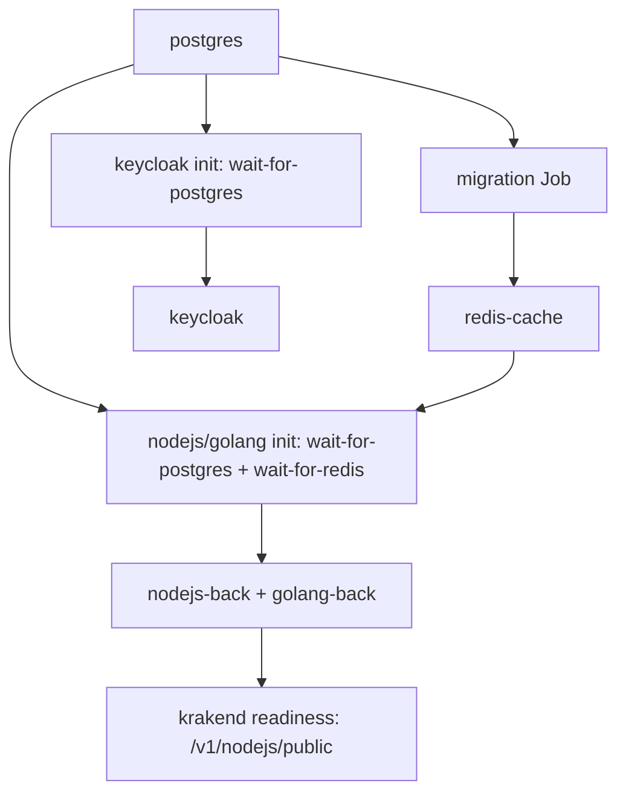

# Architecture

Visual description of what `./start` deploys. Component sources live in this repo (`nodejs-back/`, `golang-back/`, `react-front/`); everything else is defined in `helm-chart/`.

## Component topology

## Request flow

Gateway endpoints (from `helm-chart/config/krakend.json`): `/healthz`, `/v1/nodejs/{public,private,fibonacci}`, `/v1/golang/{public,private}`, `/v1/golang/public/fibonacci/{num}`, `/v1/golang/public/primes/{num}`. `/v1/*/private` require a valid `reactclient` JWT (Direct Access Grants enabled, so `grant_type=password` works too — this is what the `./start` smoke tests use).

## Data & persistence

- **Postgres** — StatefulSet with static PV (hostPath `/data/postgresql`, storageClass `manual`, survives pod restarts, dies with `./stop --purge`). Credentials from the SOPS-encrypted `postgres-secret` (`database.*` in `secrets.yaml`). NetworkPolicy: only `app: back` (both backends), `app: auth` (Keycloak) and `app: migration` (migration Job + backup CronJobs) may connect; egress denied.
- **Migrations** — `postgres-migration-1-job` runs `migrations/migration-1.sql`: creates `nodejs_numbers` / `golang_numbers` and seeds rows **3087** and **1703**. Helm Job semantics: runs on install, not re-run on upgrade (delete it first if you edit the SQL: `kubectl delete job postgres-migration-1-job`).
- **Redis** — Deployment with PVC at `/data/redis`, config from `redis-cache-configmap` (AOF enabled). NetworkPolicy: only `app: back` may connect. Both backends cache here (`REDIS_HOST`/`REDIS_PORT` are baked into `postgres-secret`).

## Auth model

- Realm `demorealm` is imported from `config/realm-export.json` (rendered through Helm `tpl`, so the demo user comes from `values.yaml auth.seedUser`). Import happens only when the realm doesn't exist yet — changes made in the Keycloak UI persist in Postgres.
- Client `reactclient` — public client, redirect `http://grogu.test/`, web origin `http://grogu.test`, Direct Access Grants ON.
- KrakenD `auth/validator` (RS256) fetches public keys from `http://keycloak-auth-clusterip:8080/realms/demorealm/protocol/openid-connect/certs` and validates the `Authorization: Bearer` on `/v1/*/private`.

## Startup order (why pods wait)

Init container definitions live in `helm-chart/templates/_helpers.yaml`. Until Redis is answerable, both backends stay in `Init:0/2` — a stuck init container almost always means Postgres or Redis is not up.

## Deployment toggles

| Toggle | Default | Effect |
|---|---|---|
| `metrics.enabled` | false | installs kube-prometheus-stack (vendored subchart); adds prom.test / grafana.stack behind the ingress |
| `loadGenerator.enable` | false | 20 busybox pods hammering nodejs `/fibonacci` to demo the HPA |

## Known issues / shortcuts (accepted for the local pet project)

After the 2026-10 production-pattern pass, the list shrank to:

1. Everything is single-replica (postgres, redis, keycloak, backends); the PDBs and zero-downtime strategies matter only once that changes.
2. Postgres PV is hostPath (`DirectoryOrCreate`, class `manual`) and the `pg_dumpall` backups land on the same volume — node loss loses data AND backups; no restore automation.
3. SOPS still uses the committed demo PGP key (swap to age + untracked key before anything real).
4. `VITE_*` env in the chart stay no-ops — Keycloak URLs are baked into the published image (orbstack's CI build uses the `*.test` defaults).
5. JS/Go dependency audit findings are not triaged (mostly transitive/dev-time).
6. Metrics on orbstack fit an 8 GB machine only because the kube-prometheus-stack block trims the subchart (no alertmanager/webhooks/k3s-embedded targets, 2h retention).

Already fixed in that pass (was on this list before): Redis → StatefulSet, Keycloak production mode (26.8, `--health/--metrics` on :9000; `auth.devMode` rollback), golang `/metrics` + HPA + ServiceMonitor, PDBs + NetworkPolicies + securityContext everywhere, image bumps (redis 7.4, postgres 17.6, keycloak 26.8, krakend 2.9.4), unused namespace file removed, ServiceMonitor namespace/selector bugs.
