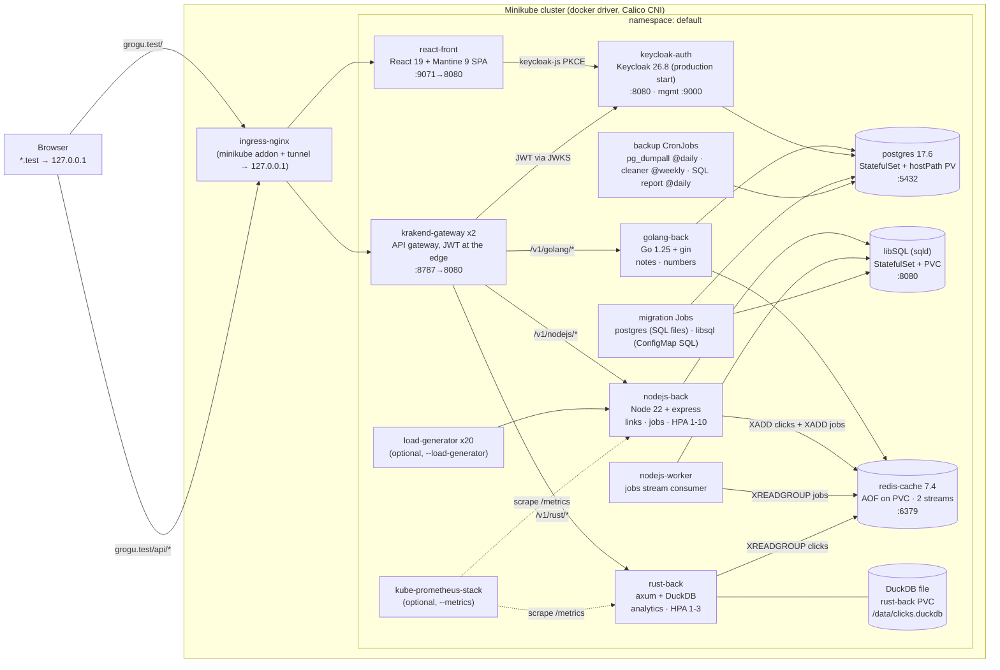
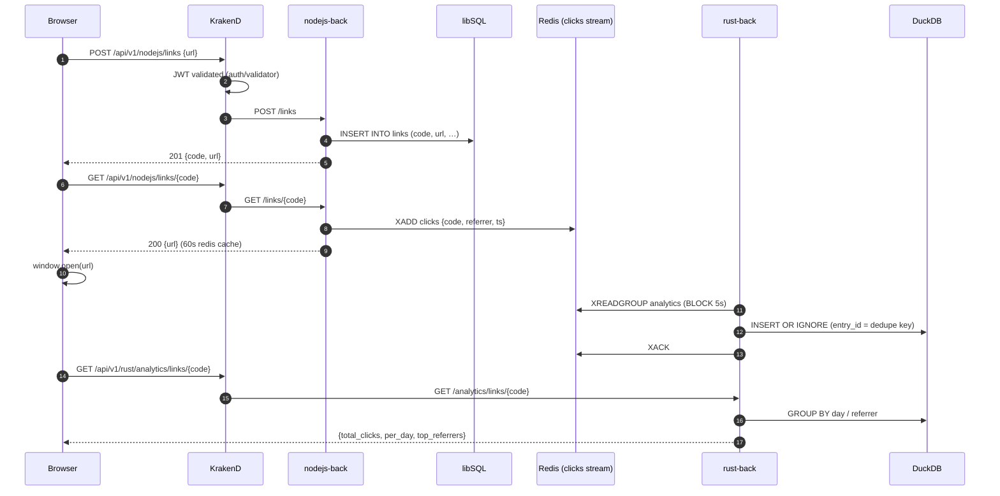
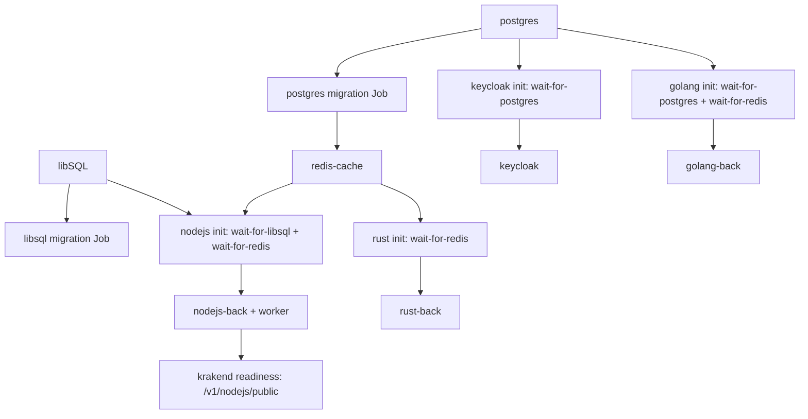

# Architecture

Visual description of what `./start` deploys. Component sources live in this repo (`nodejs-back/`, `golang-back/`, `rust-back/`, `react-front/`); everything else is defined in `helm-chart/`.

The demo is **database-per-service polyglot**: three backends, three persistence engines, and one asynchronous analytics pipeline tying them together.

| Domain | Backend | Database | Why this pair is interesting |
|---|---|---|---|
| notes + numbers/fibonacci/primes | golang-back (Go 1.25 + gin) | PostgreSQL 17.6 | classic relational CRUD, `/metrics` via promhttp |
| link shortener + async jobs + numbers | nodejs-back (Node 22 + express) | **libSQL server** (SQLite-wire, MIT, ~100MB) | server-mode SQLite, FTS5 full-text search, `@libsql/client` |
| click analytics | rust-back (axum + tokio) | **DuckDB** (embedded OLAP, MIT, in-process) | columnar aggregations over a stream-fed event table on a PVC |
| shared infra | — | Redis 7.4 | two streams (`jobs`, `clicks`) + read-through caches |

## Component topology

## Request flows

Authentication is unchanged: KrakenD `auth/validator` (RS256) validates `Authorization: Bearer` against Keycloak's JWKS on every **write** and on `/v1/*/private`. Reads are public.

Gateway endpoints (from `helm-chart/config/krakend.json`): `/healthz`, notes `/v1/golang/notes*` (CRUD), links `/v1/nodejs/links*` (list/create/click/delete), jobs `/v1/nodejs/jobs*`, analytics `/v1/rust/analytics/{summary,top,links/{code}}`, playground `/v1/{nodejs,golang}/{public,private}`, CPU demos `/v1/nodejs/fibonacci`, `/v1/golang/public/fibonacci/{num}`, `/v1/golang/public/primes/{num}`. All writes + `*/private` require a valid `reactclient` JWT (Direct Access Grants enabled, so `grant_type=password` works — that is what the smoke tests use). Everything is `no-op` passthrough: backend statuses (401/404/204) reach the browser verbatim.

## Data & persistence (database-per-service)

- **PostgreSQL** — owned by **golang-back**: `notes`, `golang_numbers`, `daily_reports` (nightly pure-SQL CronJob). StatefulSet + static hostPath PV (`/data/postgresql`, class `manual`). Credentials from the SOPS `postgres-secret`. NetworkPolicy: only golang, keycloak and `app: migration` (migration Job + backup/report CronJobs) may connect.
- **libSQL (sqld)** — owned by **nodejs-back** (+ its worker): `links` (+ FTS5 index), `jobs`, `numbers`. StatefulSet (`SQLD_NODE=standalone`) with a PVC via volumeClaimTemplates; the image wrapper chowns the data dir and drops to the `sqld` user. Schema rides the **chart** in `helm-chart/migrations-libsql/` → ConfigMap → version-suffixed Job running the nodejs image's `scripts/migrate.js`. No auth on the HTTP interface on purpose — the NetworkPolicy admits only the nodejs backend, the worker and the migration Job.
- **DuckDB** — owned by **rust-back**: a single `clicks.duckdb` file on its own PVC, written by the same process that serves the API (single-writer by construction). At-least-once stream delivery is deduped by the redis entry id (PRIMARY KEY). `fsGroup: 65532` gives the distroless user ownership of the mount.
- **Redis** — shared infrastructure, not a system of record: `jobs` stream (nodejs producer → worker consumer group), `clicks` stream (nodejs producer → rust consumer group), read-through caches (`link:<code>` TTL 60s, fibonacci numbers for golang).

## Auth model

- Realm `demorealm` is imported from `config/realm-export.json` (rendered through Helm `tpl`, so the demo user comes from `values.yaml auth.seedUser`). Import happens only when the realm doesn't exist yet — changes made in the Keycloak UI persist in Postgres.
- Client `reactclient` — public client, redirect `http://grogu.test/`, web origin `http://grogu.test`, Direct Access Grants ON.
- Keycloak runs production `start` (26.8) with health/metrics on the management port 9000; `auth.devMode: true` is the instant rollback to `start-dev`.
- The SPA (React 19 + keycloak-js PKCE) refreshes tokens 60s before expiry; the axios interceptor attaches the token, KrakenD verifies the RS256 signature at the edge.

## Startup order (why pods wait)

Init container definitions live in `helm-chart/templates/_helpers.yaml`. Until Redis is answerable, the backends stay in `Init:0/2` — a stuck init container almost always means libSQL, Postgres or Redis is not up.

## Deployment toggles

| Toggle | Default | Effect |
|---|---|---|
| `metrics.enabled` | false | installs kube-prometheus-stack (vendored subchart); adds prom.test / grafana.test behind the ingress + 5 ServiceMonitors (nodejs, golang, rust, krakend :9090, keycloak :9000) + the analytics pipeline dashboard |
| `loadGenerator.enable` | false | 20 busybox pods hammering nodejs `/fibonacci`, golang fibonacci through the gateway AND `/v1/nodejs/links/demo001` — that last one makes the click-analytics charts move under load |

## Known issues / shortcuts (accepted for the local pet project)

After the 2026-10 database-per-service split:

1. Everything is single-replica (postgres, redis, keycloak, libsql, rust-back); the PDBs and zero-downtime strategies matter only once that changes. DuckDB additionally requires the single-replica rust-back (one file, one writer).
2. Postgres PV is hostPath (`DirectoryOrCreate`, class `manual`) and the `pg_dumpall` backups land on the same volume — node loss loses data AND backups; no restore automation (roadmap: MinIO offsite backups). libSQL/DuckDB data live on PVCs (node-pinned local-path), same single-node story.
3. libSQL accepts unauthenticated HTTP connections — guarded only by the NetworkPolicy. Fine inside the demo namespace; swap in JWT/basic auth before anything real.
4. SOPS still uses the committed demo PGP key (swap to age + untracked key before anything real).
5. `VITE_*` env in the chart stay no-ops — Keycloak URLs are baked into the published image (orbstack's CI build uses the `*.test` defaults).
6. JS/Go/Rust dependency audit findings are not triaged (mostly transitive/dev-time).
7. Metrics on orbstack fit an 8 GB machine only because the kube-prometheus-stack block trims the subchart (no alertmanager/webhooks/k3s-embedded targets, 2h retention) and because the new stores are deliberately tiny (libSQL ~100MB, DuckDB in-process).
