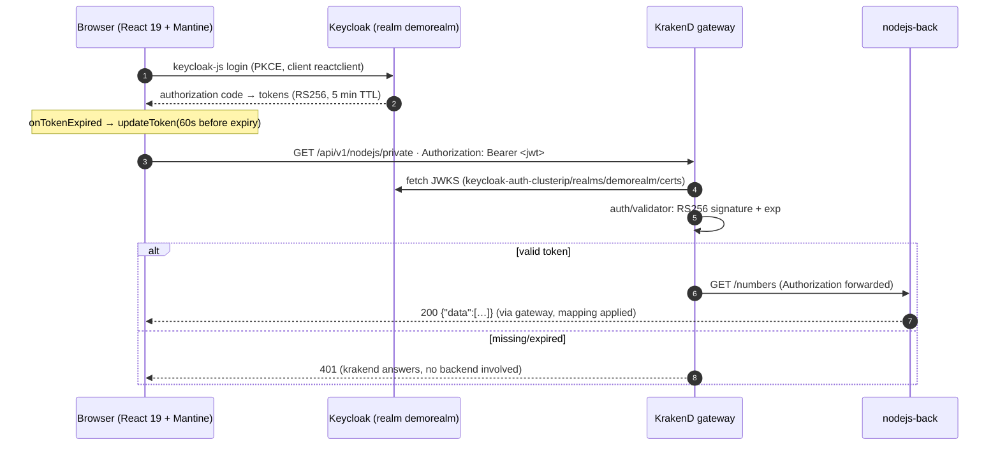
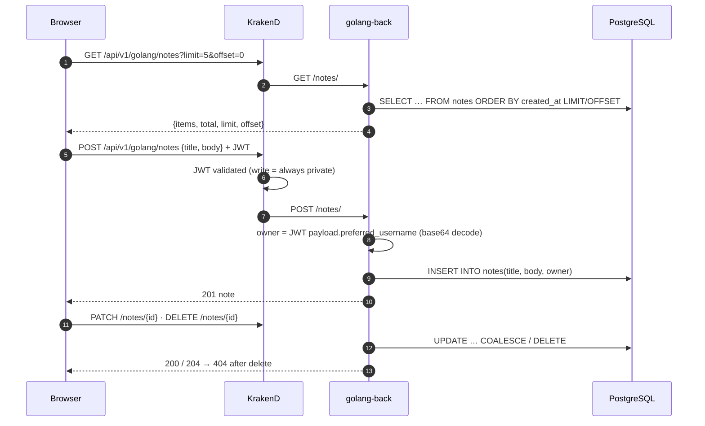
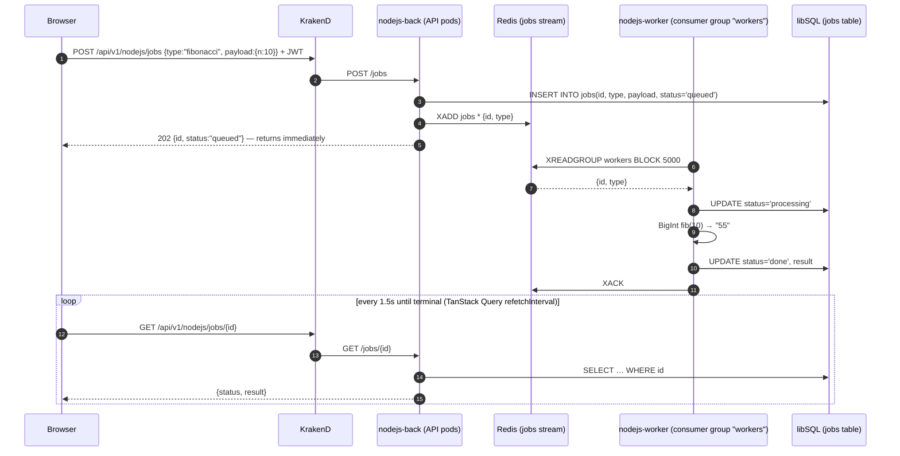
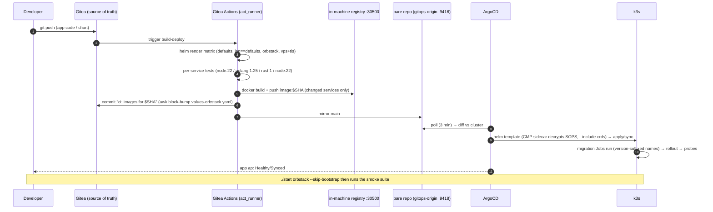
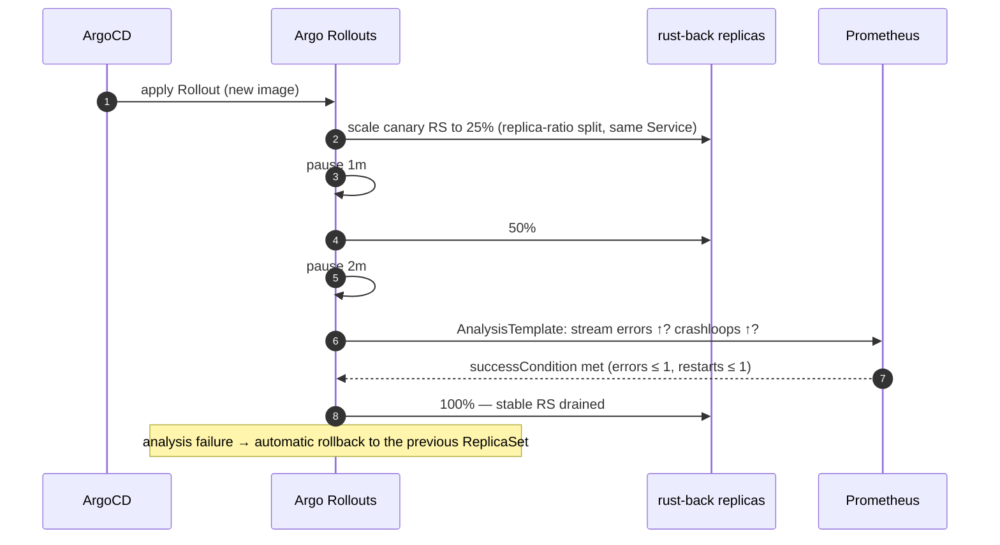

# FLOWS — sequence diagrams of the running code

Every diagram maps 1:1 to the current sources (v2 polyglot split). Read
[ARCHITECTURE.md](ARCHITECTURE.md) first for the component topology; this
file is the request-level view.

## 1. Authentication — login + the first private call

Keycloak issues the tokens; the SPA never stores them outside keycloak-js;
the gateway is the only verification point.

## 2. Notes — the golang/postgres domain

## 3. Links + click analytics — the three-database pipeline

The flagship flow: a click is written by nodejs, transported by redis,
landed by rust, and read back as DuckDB aggregations. No synchronous
coupling anywhere.

```mermaid
sequenceDiagram
    autonumber
    participant B as Browser
    participant G as KrakenD
    participant N as nodejs-back
    participant L as libSQL (links + FTS5)
    participant R as Redis (clicks stream)
    participant RS as rust-back (consumer + API)
    participant D as DuckDB (PVC)

    rect rgb(30, 60, 30)
    Note over B,L: create (JWT-validated at the gateway)
    B->>G: POST /api/v1/nodejs/links {url, title}
    G->>N: POST /links
    N->>L: INSERT INTO links(code, url, title, created_by)
    N-->>B: 201 {code: "a7Xb2K9", url, …}
    end

    rect rgb(60, 40, 10)
    Note over B,R: the click (public by design — resolving IS a click)
    B->>G: GET /api/v1/nodejs/links/a7Xb2K9
    G->>N: GET /links/a7Xb2K9
    N->>R: cache hit? (link:a7Xb2K9, TTL 60s)
    N->>L: cache miss → SELECT
    N->>R: XADD clicks * {code, referrer, ts}
    N-->>B: 200 {url} → browser opens the target
    end

    rect rgb(10, 40, 60)
    Note over RS,D: async landing (at-least-once, deduped)
    RS->>R: XREADGROUP analytics BLOCK 5000
    R-->>RS: entry 1234-1 {code, referrer, ts}
    RS->>D: INSERT OR IGNORE (entry_id = PK → replay-safe)
    RS->>R: XACK 1234-1
    end

    rect rgb(50, 20, 50)
    Note over B,D: read back as aggregations
    B->>G: GET /api/v1/rust/analytics/links/a7Xb2K9
    G->>RS: GET /analytics/links/a7Xb2K9
    RS->>D: count(*), GROUP BY epoch-day, GROUP BY referrer
    D-->>RS: rows
    RS-->>B: {total_clicks, per_day, top_referrers} → charts
    end
```

Delivery guarantees: redis streams are at-least-once — a consumer crash
between insert and XACK redelivers the entry; the stream entry id is the
DuckDB PRIMARY KEY, so replays are `INSERT OR IGNORE` no-ops. Consumer
group `analytics` keeps offsets per-service (a second analytics service
could replay the whole stream from `$` or `0`).

## 4. Async jobs — API and worker as separate deployments

Job types: `fibonacci` (CPU demo, drives the HPA story) and `wordcount`
(carries its own `payload.text` — no cross-database reads: notes belong to
golang's postgres now).

## 5. Deploy — from `git push` to running pods (orbstack shape)

The local minikube path skips CI/ArgoCD: `./start` renders the same chart
with `helm secrets upgrade --install` directly.

## 6. Progressive delivery (roadmap toggle) — canary for rust-back

Active when `rustBack.rollout.enabled: true` (Argo Rollouts controller
installed via the ansible role) — see ARCHITECTURE.md "Deployment toggles".

## 7. Chaos experiments (roadmap toggle)

Applied by hand from [CHAOS.md](CHAOS.md) + `docs/chaos/*.yaml`; every
experiment has an expected outcome tied to a hardening mechanism (PDB,
readiness, init containers, HPA). Nothing here runs automatically.
