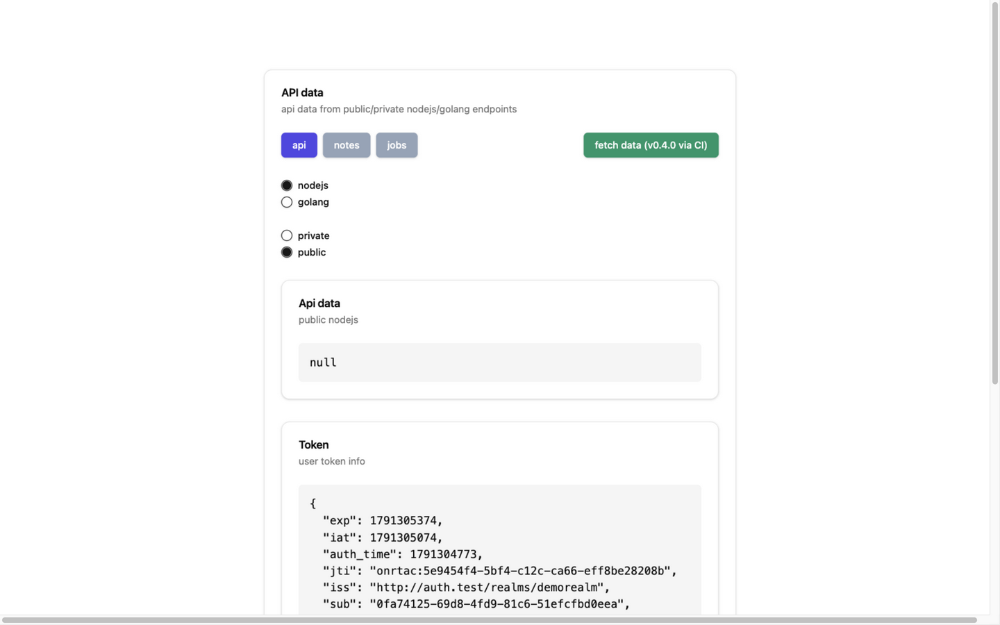
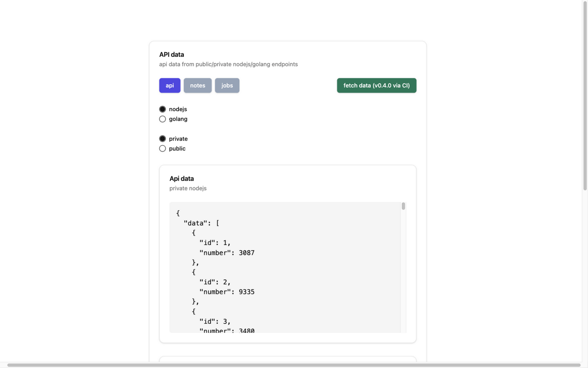
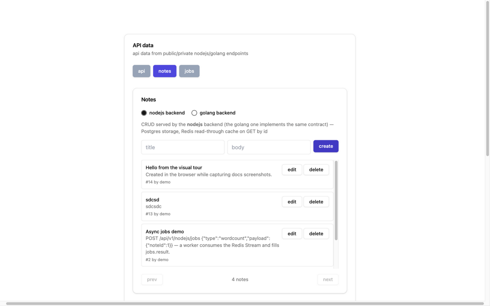
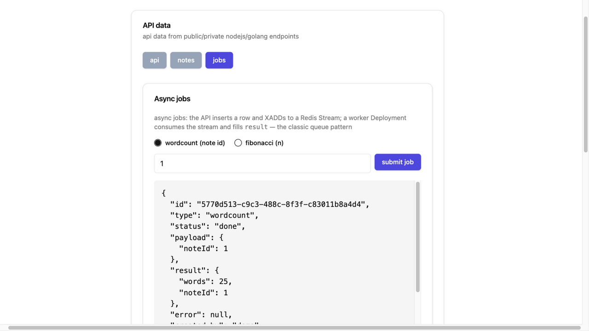
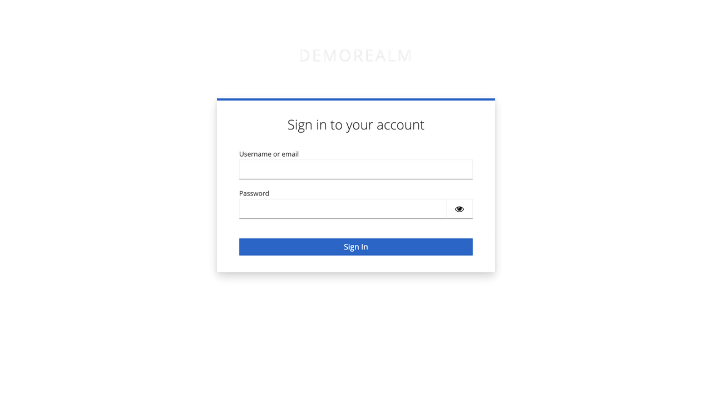
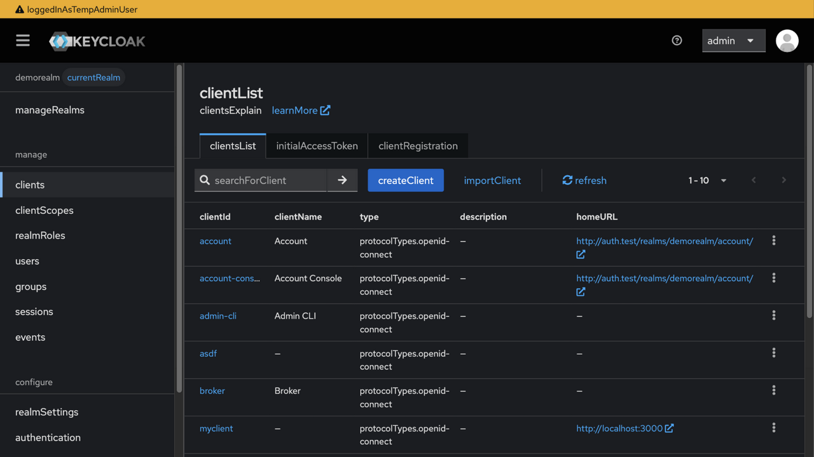
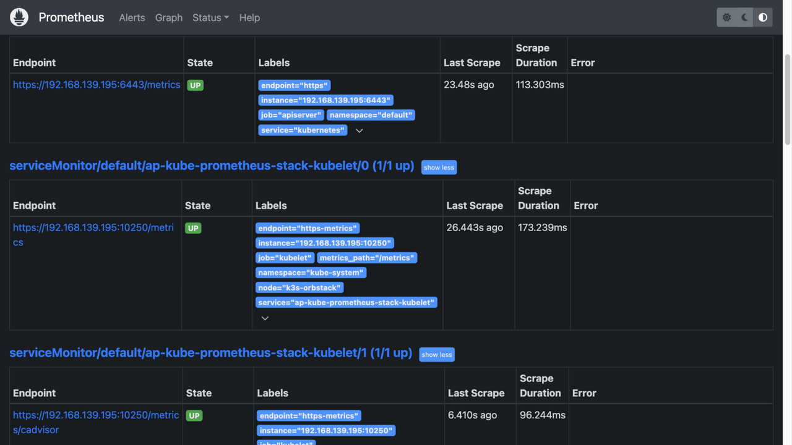
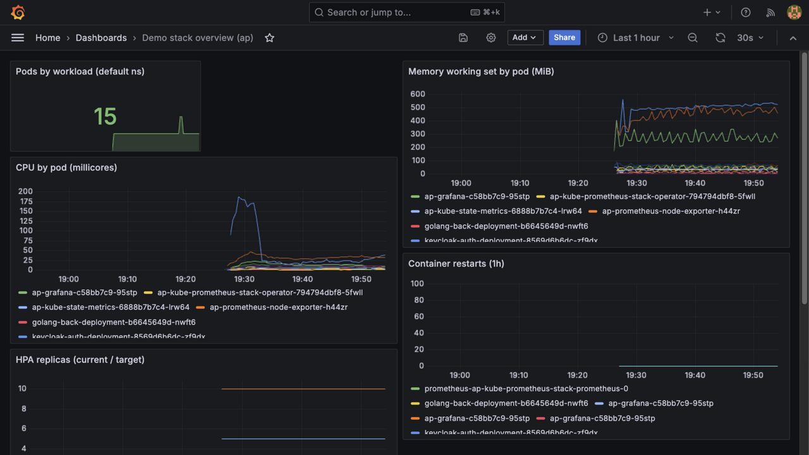
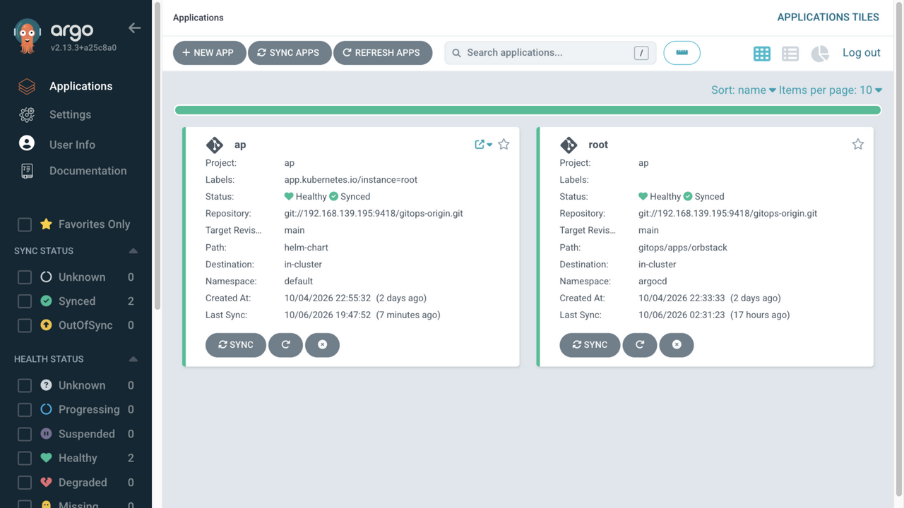

# Visual tour — what you get when it's running

Screenshots taken live from the OrbStack deployment (October 2026). Follow
along: bring the stack up with `./start orbstack`, run
`./scripts/dev-hosts.sh orbstack --install`, and open the same URLs.

## 1. The application — http://grogu.test/

Login with **demo / demo** (the account is seeded into Keycloak on first
boot). The SPA has three views behind the `api / notes / jobs` buttons.

The landing view is an API playground: pick a backend (nodejs / golang), pick
public / private, hit **fetch data**. Public endpoints need no auth; private
ones send your JWT, which KrakenD validates before proxying:



A **private** fetch with a valid token returns the numbers collection from
Postgres — status 200 with the `Authorization: Bearer` header attached
automatically from your login:



### Notes — one API contract, two backends

The `notes` view is full CRUD against Postgres with a Redis read-through
cache (TTL 60s). Create a note, edit it inline, delete it, page through.
The radio switches between the **nodejs and golang backends** — two
independent implementations of the same REST contract writing to the same
tables. Writes are JWT-gated at the gateway; the owner column comes from your
token (`preferred_username`):



### Jobs — the async queue pattern

The `jobs` view demonstrates queue-based work: the API inserts a row and
publishes to a Redis Stream, a separate worker Deployment consumes the stream
in a consumer group and writes the result back. Submit a **wordcount** job on
note 1 and watch it go `queued → processing → done` (the panel polls every
1.5s) — this screenshot caught a finished job (`words: 25`):



## 2. Keycloak — http://auth.test/

Every login goes through this page (realm `demorealm`, client `reactclient`,
PKCE):



The admin console (`http://auth.test/admin/`, **admin / admin**) manages the
realm: users, sessions, clients. The `reactclient` the SPA uses is defined in
`helm-chart/config/realm-export.json` and imported on first boot — change
hosts there, not by hand:



## 3. Prometheus — http://prom.test/ (or the port-forward)

All four apps publish `/metrics` and are scraped through ServiceMonitors.
The Targets page is the health check for the whole observability wiring —
every target should be `UP`:



## 4. Grafana — http://grafana.test/ (or the port-forward)

Login **admin / prom-operator**. The "Demo stack overview" dashboard is
provisioned automatically from a ConfigMap in the chart — pod CPU/memory,
HPA replicas, restarts, available-vs-desired. The spike at 19:30 below is the
monitoring stack itself being installed:



## 5. ArgoCD — http://argocd.test/ (or the port-forward)

The GitOps control plane. Password: `cat .local/argocd-orbstack-admin-pw`.
Two Applications: `root` (the app-of-apps pointing at
`gitops/apps/orbstack`) and `ap` (the chart itself). Green = synced from git
and healthy — this is the screen that tells you a `git push` landed:



## Without the hosts file

The smoke tests never need hosts entries (`curl --resolve`), but a browser
does. If you don't want to edit `/etc/hosts`, forward the UIs to localhost
instead (the app and Keycloak still need the names — they're baked into the
build and the realm redirect URIs):

```bash
kubectl -n default port-forward svc/ap-grafana 3001:80
kubectl -n default port-forward svc/ap-kube-prometheus-stack-prometheus 9091:9090
kubectl -n argocd port-forward svc/argocd-server 8091:80
```
