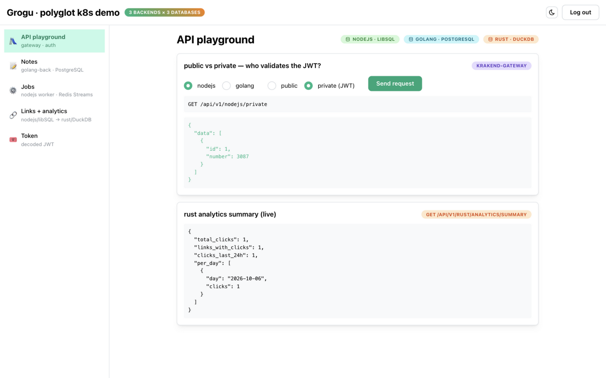
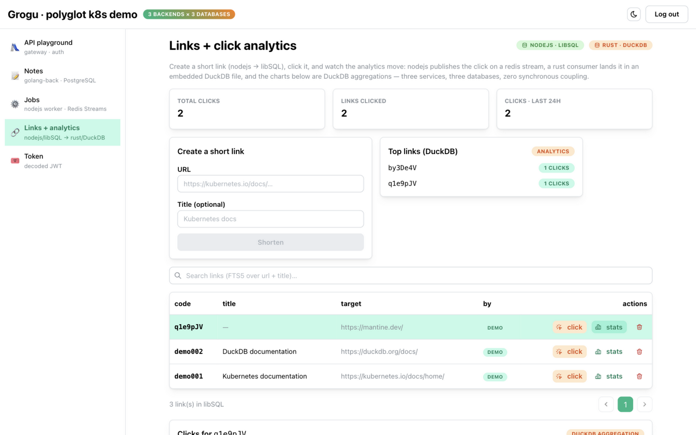
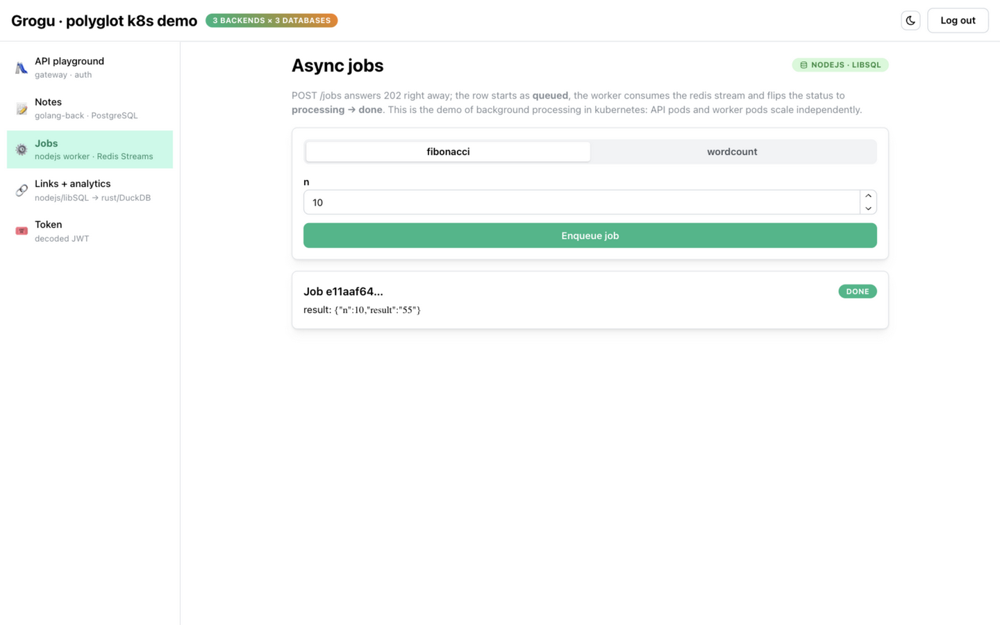
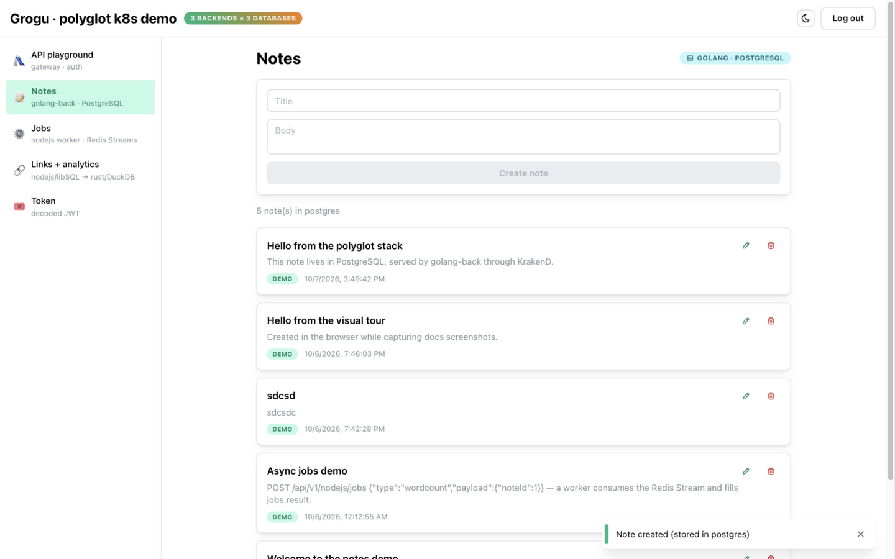
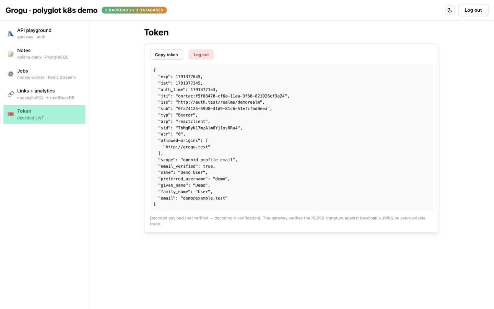
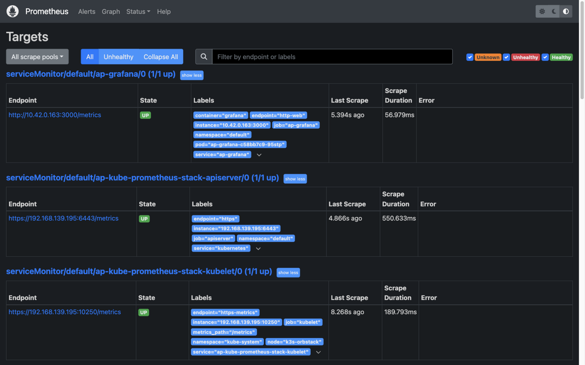
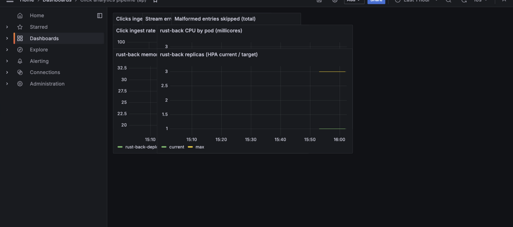

# Visual tour v2 — the polyglot stack (React 19 + Mantine, three backends)

Screenshots taken live from the OrbStack deployment. Bring the stack up with
`./start orbstack --skip-bootstrap`, run `scripts/dev-hosts.sh orbstack
--install` (one-time, sudo), and open the same URLs.

> **Version note:** the v1 tour (React 18 + shadcn UI, two backends sharing
> one Postgres) is preserved in [archive/v1/](archive/v1/TOUR-v1.md). This is
> v2: React 19 + Mantine front, database-per-service backends
> (golang→PostgreSQL, nodejs→libSQL, rust→DuckDB) and the async
> click-analytics pipeline.

Login with **demo / demo** (the account is seeded into Keycloak on first boot).

The Mantine AppShell has five views in the navbar; every card carries a
**service × database badge** — the thread to follow in the tour.

## 1. API playground — http://grogu.test/ (route `/`)

Pick a backend (nodejs / golang) and public / private, hit **Send request**.
Public endpoints need no auth; private ones send your JWT, which KrakenD
validates before proxying. A private request **logged out** answers 401 — the
gateway's verdict, not a backend's. The card at the bottom polls the rust
analytics summary live (DuckDB aggregations through the gateway).

## 2. Links + analytics — route `/links`

The flagship view:

- **Create a short link** (form on the left) → the code is generated in
  nodejs-back and stored in **libSQL**.
- The right card lists the **top links by clicks** straight from **DuckDB**.
- Press **click** on a row: a new tab opens the target and the click event is
  published on the redis `clicks` stream. Within ~5 seconds the three summary
  cards and the per-day chart tick up — three services, three databases, zero
  synchronous coupling.
- **stats** opens the per-link panel: clicks per day (line) and top referrers
  (bars), both DuckDB `GROUP BY` aggregations.
- The search box is FTS5 full-text search over url + title — a libSQL party
  trick.

## 3. Jobs — route `/jobs`

Enqueue fibonacci(10): the API answers 202 immediately (row `queued` in
libSQL, event on the redis `jobs` stream), the separate **worker** Deployment
consumes it and flips the status to done with the result — TanStack Query
polls the progress live. API and worker scale independently (KEDA can scale
the worker on stream backlog — roadmap).

## 4. Notes — route `/notes`

The relational domain, owned by golang-back: create, edit, delete notes in
**PostgreSQL**, with pagination and owner attribution from the JWT claims.

## 5. Token — route `/token`

The decoded JWT payload plus a copy button. Decoding ≠ verification — the
RS256 signature is checked by the gateway against Keycloak's JWKS on every
private route and write.

## 6. Keycloak — http://auth.test/

Realm `demorealm`, client `reactclient`, seeded user demo/demo. The SPA uses
keycloak-js with PKCE and refreshes the token 60s before expiry.

## 7. Prometheus — http://prom.test/

Five scrape targets: nodejs, golang, rust, krakend (:9090), keycloak (:9000).
Try `analytics_clicks_ingested_total` — the counter the rust consumer bumps
on every committed click.

## 8. Grafana — http://grafana.test/ (admin / prom-operator)

Two dashboards: **Demo stack overview** (pods, CPU, HPA replicas, restarts)
and **Click analytics pipeline** (ingest rate, stream errors, rust pods).

## 9. ArgoCD — in-cluster (no screenshot — add `argocd.test` to /etc/hosts next to grogu.test, or `k3s kubectl -n argocd port-forward svc/argocd-server 8080:80`)

The `ap` application syncing the chart from git — the same chart the local
`./start` uses. This is the GitOps proof: what runs equals what is committed.

## Sequence diagrams

The request/response flows behind these screens are drawn in
[FLOWS.md](FLOWS.md) — auth, notes, links + the click→DuckDB pipeline, async
jobs, and the GitOps deploy flow.
